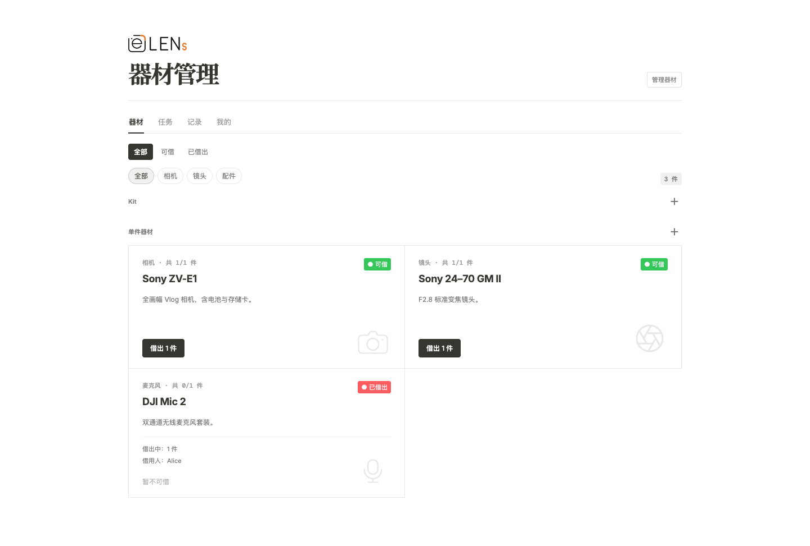
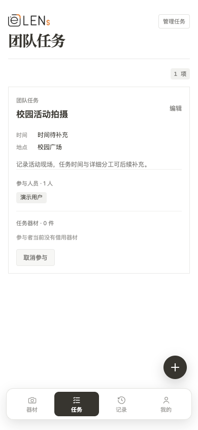
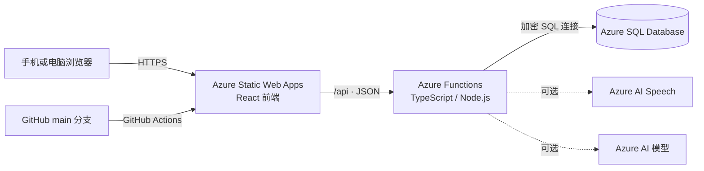

# ZJE-Lens 团队工作台

一个面向熟人小团队的器材借还与任务协作网站，最初为 ZJE-Lens 摄影团队开发。

它适合十几人到几十人的摄影团队、工作室、社团或实验室：成员之间互相认识，希望用尽量少的操作完成器材登记、借出、归还、任务参与和历史查询。项目没有密码和复杂权限系统，第一次输入姓名后会在当前浏览器记住身份。

> [!IMPORTANT]
> 这是一个低摩擦的熟人团队工具。API 默认允许匿名访问，知道网址的人可以注册姓名并进行操作。它不适合公开互联网服务、互不信任的用户群体或需要严格权限审计的高价值资产管理场景。

> [!TIP]
> **学生可以先申请 [GitHub Student Developer Pack](https://education.github.com/pack/)。** GitHub Education 中的 Microsoft Azure 学生权益目前提供 25 项以上 Azure 云服务的免费使用资格和 **100 美元 Azure 额度**，且无需信用卡，适合用来学习并部署本项目。Azure 权益要求学生年满 18 岁；具体资格、额度、有效期和可用地区可能调整，请以申请页面显示的最新条款为准。

## 界面预览

### 桌面端器材管理



### 手机端团队任务

<p align="center">
  
</p>

截图使用本地模拟数据生成，不包含正式数据库中的成员或借还记录。

## 主要功能

- 姓名即身份：第一次输入 2–6 个中文汉字，浏览器通过 `localStorage` 记住当前成员。
- 器材库存：支持类别、数量、备注、可借数量和借用人。
- Kit：将多件器材组成一套，整套借出和归还。
- AI 快速借用：用中文语音或文字描述器材与数量，先生成可编辑清单，确认后一次性借出。
- 借还记录：永久保留借出时间、归还时间和借用人，可导出 CSV。
- 团队任务：发布任务、补充时间与地点、参与或取消参与、归档和删除。
- 任务器材：参与者名下正在借用的器材会自动显示在相应任务中。
- 手机优先：响应式布局、悬浮底部导航、自动跟随系统深色模式。
- 数据一致性：借出操作使用 SQL 事务和锁，避免多人同时借出超过库存。

## 系统如何运行



各部分职责如下：

1. **React 前端**负责页面显示和交互。`localStorage` 只保存当前浏览器使用的成员 ID 与姓名。
2. **Azure Functions**提供 `/api/*` REST API，检查输入并处理借出、归还、任务、Kit 和 AI 指令解析。
3. **Azure SQL Database**是唯一的业务数据源，保存成员、器材、库存、任务和全部历史记录。
4. **Azure Static Web Apps**托管前端，并将同一域名下的 `/api` 请求转发给项目中的 Functions。
5. **GitHub Actions**在每次推送到 `main` 后自动构建并部署前端与 API。

AI 助手只负责把自然语言转换成候选清单，不会听到一句话就直接改数据库。用户确认后，后端才会在一个 SQL 事务中重新检查全部实时库存；任意一项库存不足，整次批量借出都会回滚，避免只借出一半。

## 技术栈

| 部分 | 技术 |
| --- | --- |
| 前端 | React 19、TypeScript、Vite |
| 后端 | Azure Functions v4、TypeScript、Node.js |
| 数据库 | Azure SQL Database、`mssql` |
| 语音识别（可选） | Azure AI Speech SDK |
| 文字理解（可选） | Azure OpenAI 兼容的 Azure AI 模型部署 |
| 托管 | Azure Static Web Apps |
| 自动部署 | GitHub Actions |

## 项目结构

```text
.
├── src/
│   ├── App.tsx                  # 页面、交互与主要组件
│   ├── App.css                  # 响应式布局和深色模式
│   ├── VoiceBorrowDialog.tsx    # AI 语音/文字快速借用界面
│   ├── api.ts                   # 前端唯一的 API 入口
│   ├── mockApi.ts               # 本地演示用模拟数据
│   ├── types.ts                 # 前端数据类型
│   └── assets/
│       └── zje-lens-logo.png    # 团队 Logo
├── api/
│   ├── src/index.ts             # Azure Functions 路由与业务逻辑
│   ├── src/ai.ts                # AI 指令解析与 Speech 短期令牌
│   ├── src/database.ts          # Azure SQL 连接池
│   └── local.settings.json.example
├── database/
│   ├── schema.sql               # 全新数据库完整初始化脚本
│   ├── equipment-quantity.sql   # 旧数据库的库存数量迁移
│   ├── kits.sql                 # 旧数据库的 Kit 功能迁移
│   └── tasks.sql                # 旧数据库的任务功能迁移
├── public/                      # favicon、站点验证文件等静态资源
├── staticwebapp.config.json     # Static Web Apps 路由设置
└── .github/workflows/           # 自动部署工作流
```

## 本地体验

需要 Node.js 20 或更高版本。

```bash
git clone https://github.com/tintin-zheng/equipment-manager.git
cd equipment-manager
npm install
npm run dev
```

打开 `http://localhost:5173`。

本地开发默认使用 `src/mockApi.ts`，不需要 Azure 账号或数据库，可以直接体验注册身份、借出、归还、Kit、任务和快速借用的文字清单。模拟借还数据在刷新页面后会重置，浏览器记住的身份仍会保留。语音输入必须连接本地 Functions 并配置 Azure Speech；没有配置时可以继续使用文字输入或普通借出按钮。

提交前可以运行：

```bash
npm run lint
npm run build
npm run build --prefix api
```

## 部署到自己的 Azure

下面是一套从空白 Azure 账号开始的完整流程。Azure Portal 的栏目名称可能随界面更新略有变化，但需要填写的内容不变。

### 学生部署前：申请 GitHub Education 与 Azure 学生额度

如果你是在校学生，建议先完成学生认证，再创建 Azure 资源：

1. 打开 [GitHub Student Developer Pack](https://education.github.com/pack/)，登录自己的 GitHub 账号。
2. 按页面要求提交学生身份认证。通常可以使用学校邮箱、学生证或其他在读证明；审核方式以 GitHub Education 当前页面为准。
3. 认证通过后，在 Student Developer Pack 中找到 **Microsoft Azure** 权益并点击领取。
4. 按提示登录或创建 Microsoft 账号，激活 Azure 学生订阅。Azure 权益目前要求申请人年满 18 岁。
5. 进入 [Azure Portal](https://portal.azure.com/) 后，在“订阅”页面确认能够看到学生订阅，再继续创建本项目需要的资源。

当前 GitHub Education 页面展示的 Azure 学生权益包括：

- 25 项以上 Microsoft Azure 云服务的免费使用资格；
- 100 美元 Azure credit；
- 申请时无需绑定信用卡；
- Azure 云服务与相关学习资源。

本项目的 Azure Static Web Apps 可以使用 Free 计划，Azure Functions 由 Static Web Apps 集成托管，Azure SQL 则可以优先选择免费额度或低配 Serverless。对于十几人规模、访问频率不高的团队，学生额度通常足以支持学习和早期使用，但这不代表所有资源永久免费。

使用学生订阅时请注意：

- 创建 SQL Database 和 Static Web App 时，确认“订阅”选择的是已经激活的学生订阅；
- 在 Azure Cost Management 中查看余额和资源消耗，并按需设置预算提醒；
- Serverless SQL 自动暂停可以节省额度，但长时间无人访问后的第一次打开会有冷启动等待；
- 额度用完或权益到期后，资源可能暂停。只有主动升级到付费订阅后才会继续产生实际费用；升级前请先确认 Azure 页面显示的计费规则；
- 不要把 Azure 部署令牌、SQL 密码或连接字符串提交到 GitHub。

也可以直接查看 [Azure for Students 官方页面](https://azure.microsoft.com/free/students/) 获取最新说明。GitHub Education 和 Azure 的优惠内容可能随时间、地区及个人资格变化，README 中的数字仅对应当前页面展示的信息。

### 1. Fork 仓库并准备代码

1. 点击 GitHub 页面右上角的 **Fork**，将仓库复制到自己的 GitHub 账号。
2. 如果需要，先按照下文“更换团队名称和 Logo”完成品牌替换。
3. 确认默认分支为 `main`。

你也可以先克隆自己的 Fork：

```bash
git clone https://github.com/<你的 GitHub 用户名>/equipment-manager.git
cd equipment-manager
npm install
```

### 2. 创建 Azure SQL Database

在 Azure Portal 中搜索 **SQL databases**，选择“创建”：

1. 创建或选择一个资源组，例如 `equipment-manager-rg`。
2. 数据库名称可填写 `equipment_manager`。
3. 点击“创建新服务器”，选择距离团队较近的区域。
4. 身份验证方式请选择支持 **SQL 身份验证** 的选项，并设置管理员用户名和高强度密码。
5. 不要启用“仅 Microsoft Entra 身份验证”，除非你准备自行改造后端连接方式。
6. 计算层选择适合小项目的免费额度或较低配置的 Serverless。启用自动暂停可以节省费用，但长时间无人访问后的第一次打开可能需要几十秒唤醒。
7. 网络连接选择公共终结点。在服务器防火墙中：
   - 添加你当前电脑的客户端 IP，便于使用查询编辑器；
   - 开启“允许 Azure 服务和资源访问此服务器”，让 Static Web Apps 中的 Functions 可以连接数据库。

创建完成后，进入数据库的 **Query editor / 查询编辑器**，使用刚才创建的 SQL 管理员账号登录。

打开 [`database/schema.sql`](database/schema.sql)，复制全部 SQL 并执行一次。该文件会创建：

- `members`
- `equipment`
- `borrow_records`
- `tasks` 与 `task_participants`
- `kits`、`kit_items` 与 `kit_borrow_records`
- 必要的外键、检查约束和索引

`schema.sql` 最后包含几条演示成员和器材数据。部署给自己的团队时，可以在执行前删除最后两条 `INSERT`，让数据库从空数据开始。

> [!WARNING]
> `schema.sql` 只应对全新数据库执行一次。已经部署过旧版本的数据库不要重复执行；应根据缺少的功能分别执行 `equipment-quantity.sql`、`kits.sql` 或 `tasks.sql`，每个迁移文件同样只执行一次。

### 3. 准备 SQL 连接字符串

进入 Azure SQL Database 的“连接字符串”页面，准备如下格式的连接字符串：

```text
Server=tcp:<服务器名>.database.windows.net,1433;Initial Catalog=<数据库名>;Persist Security Info=False;User ID=<SQL管理员用户名>;Password=<SQL管理员密码>;MultipleActiveResultSets=False;Encrypt=True;TrustServerCertificate=False;Connection Timeout=30;
```

不要把真实密码写进代码、README、Git 提交或公开截图。下一步会把它保存为 Azure 的加密应用设置。

### 4. 创建 Azure Static Web App

在 Azure Portal 中搜索 **Static Web Apps**，选择“创建”：

1. 使用与 SQL Database 相同或邻近的资源组和区域。
2. 托管计划选择 Free 即可满足小团队使用。
3. 部署来源选择 **Other / 其他**。本仓库已经包含 GitHub Actions 工作流，不需要 Azure 再生成一份。
4. 创建资源并等待部署完成。

进入新建的 Static Web App，在“配置 / 环境变量 / 应用设置”中新增：

| 名称 | 值 |
| --- | --- |
| `SQL_CONNECTION_STRING` | 上一步准备的完整 Azure SQL 连接字符串 |

保存后要确认设置已经应用成功。Functions 运行时会从这里读取连接字符串。

### 5. 配置 AI 快速借用（可选）

不配置本节时，器材、Kit、任务、普通借还和记录功能仍然可以正常使用；只有语音识别与 AI 文字解析会显示“尚未完成 Azure 配置”。

AI 快速借用使用两个独立的 Azure 能力：

1. **Azure AI Speech**：把普通话语音转换成文字。浏览器只会获得约 10 分钟有效的短期令牌，不会接触 Speech 密钥。
2. **Azure OpenAI 兼容模型部署**：根据当前数据库里的器材和 Kit 清单，把文字转换成结构化候选项。建议选择支持 JSON 输出的低成本轻量模型部署。

在 Azure Portal 中创建 Speech 资源后，记录它的 Key 和 Region；再在 Azure AI Foundry 或 Azure OpenAI 资源中部署一个聊天模型，记录 Endpoint、Key 和部署名称。随后进入 Static Web App 的应用设置，加入：

| 名称 | 示例或说明 |
| --- | --- |
| `AZURE_SPEECH_KEY` | Speech 资源的密钥，只存 Azure 配置 |
| `AZURE_SPEECH_REGION` | 资源区域，例如 `eastasia` |
| `AZURE_AI_ENDPOINT` | `https://<资源名>.openai.azure.com` |
| `AZURE_AI_API_KEY` | AI 资源的密钥，只存 Azure 配置 |
| `AZURE_AI_DEPLOYMENT` | 你创建的模型部署名称，不是模型显示名称 |
| `AZURE_OPENAI_API_VERSION` | 默认可使用 `2024-10-21`，也可按所选模型文档覆盖 |

保存并应用设置后重新部署或重启应用。打开“器材”页面右下角的麦克风按钮，依次测试：

- 文字：`借一台 Sony A7 IV 和两块电池`；
- 语音：允许浏览器使用麦克风，说完后等待清单出现；
- 调整数量或删除误识别项目，再点击“确认借出”；
- 故意请求超过库存的数量，确认系统会阻止整批操作。

模型和 Speech 都按 Azure 账号及区域的实际定价计费。建议在 Azure Cost Management 中建立小额预算提醒，并在 AI 资源中设置较低配额。由于本项目没有登录系统，若将网址公开传播，匿名访问者可能消耗 AI 配额；它更适合只在熟人团队内分享。

### 6. 配置 GitHub 部署令牌

1. 在 Azure Static Web App 概览页选择 **Manage deployment token / 管理部署令牌**。
2. 复制部署令牌。
3. 打开你 Fork 后的 GitHub 仓库。
4. 进入 **Settings → Secrets and variables → Actions**。
5. 点击 **New repository secret**，创建：

```text
Name:  AZURE_STATIC_WEB_APPS_API_TOKEN
Value: <刚才复制的部署令牌>
```

令牌是敏感信息，不要放进普通变量、代码或聊天截图。

### 7. 检查自动部署配置

仓库中的 GitHub Actions 工作流已经配置好三个路径：

```yaml
app_location: "/"
api_location: "api"
output_location: "dist"
```

工作流还会在生产构建中设置：

```yaml
VITE_USE_MOCK_API: "false"
```

因此线上网站会请求真实的 Azure Functions，而不是本地模拟数据。

推送任意一次提交到 `main`：

```bash
git add .
git commit -m "Configure my team workspace"
git push origin main
```

然后进入 GitHub 仓库的 **Actions** 页面，等待 `Azure Static Web Apps CI/CD` 显示绿色成功标记。

### 8. 验证部署

Azure 会提供类似下面的地址：

```text
https://<随机名称>.azurestaticapps.net
```

依次检查：

1. 打开网站，输入一个中文姓名。
2. 录入一件测试器材并尝试借出、归还。
3. 打开 `https://<你的地址>/api/members`，应看到 JSON 成员列表。
4. 刷新网页，确认浏览器仍记得当前姓名。
5. 在另一个浏览器中访问，确认器材状态来自数据库而不是当前设备。

如果网页能打开但 API 报错，优先检查：

- Static Web App 的 `SQL_CONNECTION_STRING` 是否填写完整并点击了保存；
- SQL Server 是否允许 Azure 服务访问；
- 数据库是否已经执行完整的 `schema.sql`；
- SQL 用户名、密码、服务器名和数据库名是否正确。

## 更换团队名称和 Logo

### 最简单的 Logo 替换方式

将你自己的透明背景 PNG 命名为：

```text
zje-lens-logo.png
```

然后覆盖：

```text
src/assets/zje-lens-logo.png
```

保持文件名不变就不需要修改 React 代码。推荐使用横向、透明背景的 PNG；页面会自动等比例缩放。

Logo 尺寸由 [`src/App.css`](src/App.css) 中的 `.site-logo` 控制。如果彩色 Logo 在深色模式下不适合自动反色，可以同时修改深色模式中的 `.site-logo` 规则。

### 修改网站名称

在项目中搜索 `ZJE-Lens`，主要需要修改：

- [`index.html`](index.html) 中浏览器标签页的 `<title>`；
- [`src/App.tsx`](src/App.tsx) 中 Logo 的 `alt` 文本和 CSV 导出文件名；
- 本 README 的标题与介绍。

网站图标位于 [`public/favicon.svg`](public/favicon.svg)，也可以替换成自己团队的 favicon。

修改完成后提交到 `main`，GitHub Actions 会自动重新部署，无需在 Azure Portal 中重新创建资源。

## 环境变量

| 名称 | 使用位置 | 说明 |
| --- | --- | --- |
| `VITE_USE_MOCK_API` | 前端构建 | `false` 时请求真实 `/api`；本地未设置时使用模拟数据 |
| `SQL_CONNECTION_STRING` | Azure Functions | Azure SQL 连接字符串，只保存在 Azure 应用设置或本地未提交的配置文件中 |
| `AZURE_SPEECH_KEY` | Azure Functions | 可选，Speech 密钥；不会发送到前端 |
| `AZURE_SPEECH_REGION` | Azure Functions | 可选，Speech 资源所在区域 |
| `AZURE_AI_ENDPOINT` | Azure Functions | 可选，Azure OpenAI 兼容端点 |
| `AZURE_AI_API_KEY` | Azure Functions | 可选，AI 资源密钥；不会发送到前端 |
| `AZURE_AI_DEPLOYMENT` | Azure Functions | 可选，聊天模型的部署名称 |
| `AZURE_OPENAI_API_VERSION` | Azure Functions | 可选，默认 `2024-10-21` |

本地调试 Functions 时，可以复制示例配置：

```bash
cd api
npm install
cp local.settings.json.example local.settings.json
```

将自己的连接字符串和需要调试的 AI 配置填入 `local.settings.json`，安装 Azure Functions Core Tools v4 后运行：

```bash
npm run build
npm start
```

若要让 Vite 前端调用本地 Functions，可在另一个终端使用 `VITE_USE_MOCK_API=false npm run dev`。项目已经把开发环境中的 `/api` 代理到 Functions 默认的 `http://localhost:7071`。只验证文字清单与批量借出的页面交互时，保持默认 Mock 模式最简单。

`api/local.settings.json` 包含密码和服务密钥，不应提交到 GitHub。项目只提交不含真实凭据的 `api/local.settings.json.example`。

## 数据与安全说明

- `localStorage` 只保存当前浏览器默认使用的姓名和成员 ID。
- 器材状态、任务、借还记录和归还时间全部保存在 Azure SQL。
- 借出、Kit 借出和批量归还使用数据库事务保证一致性。
- 删除器材不会破坏历史：已有借还记录的器材会被拒绝删除。
- 项目没有密码、OAuth 或管理员权限隔离，管理按钮对所有访问者可见。
- 若团队规模扩大或网址需要公开传播，建议后续增加 Microsoft Entra ID、Static Web Apps 身份验证或独立的管理员权限。

## 更新已经部署的网站

日常修改代码后只需要：

```bash
git add .
git commit -m "Describe the change"
git push origin main
```

GitHub Actions 会自动完成安装依赖、构建 React、构建 Azure Functions 和发布。Azure SQL 中的真实数据不会因为前端重新部署而丢失。

## License

当前仓库未声明开源许可证。你可以 Fork 并用于自己的学习和小型团队内部部署；如果准备公开分发或用于商业项目，请先联系仓库维护者确认授权。
